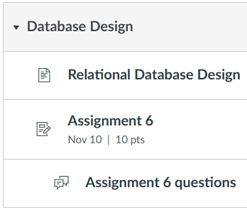

# Section 6: 11/07 - 11/10 Database Design

## Response: 8/10

Missing table for student registration.
That table should be joined to user, section and payment with FK's pointing to
these tables. Payment table should be joined to student registration.

There should be view CATALOG, which gets data from dept, location, course,
section and instructor tables.

## Rant

I really had no idea what I was doing here and I kinda deserved even less than
an 8/10.
The way that the UML is supposed to work, `*` is for `not null` and `#` is for
`foreign key`.
I probably should've watched the lectures.
I'm pretty sure most of the work here is applicable to sections 7 and 8, though.
