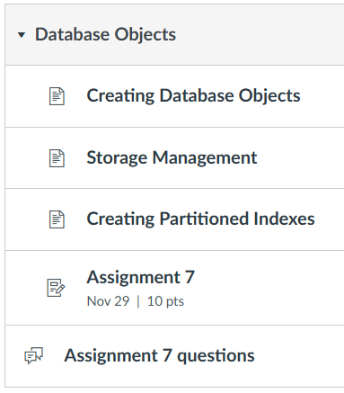

# Section 7: 11/11 - 11/29<br>Database Objects



## Data Dictionary

The data dictionary is not a table.
It's a collection of "meta tables" kinda.
`user_tables` and `user_objects` are two of them.

## user_tables

[user_tables reference](https://docs.oracle.com/cd/B28359_01/server.111/b28320/statviews_2105.htm#REFRN20286)

```cpp
// the important bits
struct user_tables {
   char table_name[30],
   char tablespace_name[30]
};
```

```sql
select tablespace_name || '::' || table_name from user_tables;

/*
ORACLECIS::LIST
ORACLECIS::DEPT
ORACLECIS::EMP
ORACLECIS::SALGRADE
ORACLECIS::PROD
ORACLECIS::VEND
*/
```

## user_objects

```cpp
struct user_objects {
   char object_name[128],
   char subobject_name[30],
   int object_id,
   int data_object_id,
   char object_type[19],
   int namespace
}
```

```sql
set wra off;
column object_name format A20;
column object_type format A11;
column subobject_name format A14;
select object_name, subobject_name, object_type, namespace from user_objects;

/*
OBJECT_NAME          SUBOBJECT_NAME OBJECT_TYPE  NAMESPACE
-------------------- -------------- ----------- ----------
LIST                                TABLE                1
SYS_C00340440                       INDEX                4
VEND                                TABLE                1
SYS_C00340438                       INDEX                4
PROD                                TABLE                1
SALGRADE                            TABLE                1
EMP_PRIM_KEY                        INDEX                4
EMP                                 TABLE                1
DEPT_PRIMARY_KEY                    INDEX                4
DEPT                                TABLE                1
*/
```

Looks like `subobject_name` is not as interesting as it could be.
One thing to note is that tables seem to be in `namespace = 1` whereas indexes
seem to be in `namespace = 4`.

## Comments

I have no idea what's the point commenting stuff in the database but sure.

Stolen from [here](https://docs.oracle.com/cd/B19306_01/server.102/b14200/statements_4009.htm):


```sql
comment on column emp.deptno is 'The department of the employee';
```

## Constraints

- not null
- unique
- primary key (implies not null and unique)
- foreign key
- check

Check is the most interesting one because you provide a predicate.

```sql
create table all_even(
   n number not null check (MOD(n, 2) = 0)
);

insert into all_even values (1); --> ORA-02290: check constraint violated

insert into all_even values (4); -- All good
```

I wonder if you could provide a bare function for the predicate?
Doesn't look like it.

Looks like constraints also have names and are "objects", so to speak, in the
server.

As I've seen and used, there are inline constraints and out of line constraints.
That's actually what they're called in the documentation.

```sql
-- inline primary key
create table foo(
   bar number primary key
);

-- out of line primary key with constraint name baz_pk
create table baz(
   qux number,
   constraint baz_pk primary key(qux)
);
```
