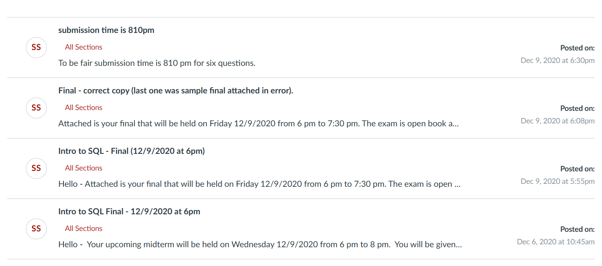

# Section 8f: 12/07 - 12/09 Final

At first, we were sent the sample final.
I thought that was strange but I did it anyways.
It was at 6:31pm that I decided to check the announcements.

## Submission

Did you figure out that `decrypt_midterm.exe` was only there to waste your time?
Here's all the info I can give you about the final:

Don't cheat, just study the material and you should be fine.
The prof grades strict but fair.
If you put in good effort, I think everyone should at least get a B.
Anyways, I hope I get a good grade.
